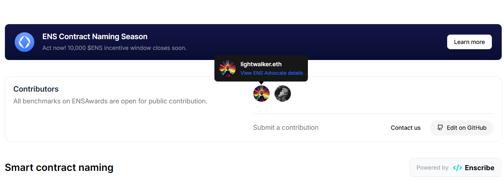

# Contributing to ENSAwards

Thank you for your interest in contributing to ENSAwards! We welcome contributions from the community and greatly appreciate your time and effort in helping us improve.

## How to contribute?

If you’re here, you likely want to propose changes to our data — perhaps adding new entities, updating benchmark details, or suggesting new best practices for our leaderboards.

Below, you’ll find detailed instructions for each contribution type. If your change doesn’t fit one of these categories, feel free to open a pull request (PR) and describe your proposal there.

### Adding yourself as a `Contributor`

Certain data models in [ensawards.org/data](ensawards.org/data) include a `contributions` field. Its type definition is shown below.

The `contributions` field type is a non-empty array of `Contribution`:

```typescript
export interface Contract {
  // ...
  contributions: [Contribution, ...Contribution[]];
}
```

```typescript
export type Contributor = AccountId;

export type Contribution = {
  /** The contributor who made the contribution */
  from: Contributor;
  /** The Unix timestamp of when the contribution was made */
  updatedAt: UnixTimestamp;
};
```

`Contributor` is an alias for `AccountId`, which is a CAIP-10 account identifier from `@ensnode/ensnode-sdk`:

```typescript
export interface AccountId {
  chainId: ChainId;
  address: Address;
}
```

This is our way to show appreciation to the people who contributed to our cause. When you add yourself to this list your ENS profile will be displayed on our site, giving you some well-deserved social credit 💪.



To add yourself:
1. Add your `AccountId` to the `contributors` collection in [ensawards.org/data/contributors/index.ts](ensawards.org/data/contributors/index.ts) (if this is your first contribution).
2. Reference yourself in the contributions array of the entity you are updating. If you update the same entity multiple times, add a separate entry for each update with the corresponding timestamp.

For reference see [ensawards.org/data/apps/metamask-wallet/benchmarks.ts](ensawards.org/data/apps/metamask-wallet/benchmarks.ts).

### Adding a new `Project`

1. Create a new subdirectory in the [ensawards.org/data/projects/](ensawards.org/data/projects) named after the project you want to add. The directory name should be the lowercase project name. If the name contains multiple words, join them with hyphens ("-").
2. Inside the new directory, create an `index.ts` file and default-export the project definition. Make sure to also call `defineProject()` on it. For reference see [ensawards.org/data/projects/aave/index.ts](ensawards.org/data/projects/aave/index.ts).
3. Follow its data model that you can look up in the [ensawards.org/data/projects/types.ts](ensawards.org/data/projects/types.ts) file. You can also have a quick glance at it below.

```typescript
export interface Project {
  id: ProjectId;
  name: string;
  description: string;
  icon: (props: React.SVGProps<SVGSVGElement>) => JSX.Element;
  socials: {
    website: URL;
    twitter: URL;
  };
}
```
4. Add an icon as a React functional component in the created directory (`icon.tsx`). For reference, see [ensawards.org/data/projects/aave/icon.tsx](ensawards.org/data/projects/aave/icon.tsx).
5. You are welcome to propose updates to already added projects using the same approach.

### Relationship between `Projects`, `Protocols` and `Apps`

Although related, these entity types represent different real-world concepts.

* `Protocols` refer to specific sets of deployed smart contracts.
* `Apps` refer to specific software applications.
* `Projects` represent a higher-level initiatives or organizations that might produce multiple related protocols and apps. A project can include multiple protocols and multiple apps.

For this reason, every new `App` or `Protocol` must be associated with a corresponding `Project`.

### Adding a new `Protocol`

1. Create a new subdirectory in the [ensawards.org/data/protocols/](ensawards.org/data/protocols) named after the protocol you want to add. The directory name should be the same as the slug of the protocol (for reference see [ensawards.org/data/protocols/ens-dao/index.ts](ensawards.org/data/protocols/ens-dao/index.ts)).
2. Inside the new directory, create an `index.ts` file and default-export the protocol definition. Make sure to also call `defineProtocol()` on it. For reference see [ensawards.org/data/protocols/ens-dao/index.ts](ensawards.org/data/protocols/ens-dao/index.ts).
3. Make sure to follow its data model that you can look up in the [ensawards.org/data/protocols/types.ts](ensawards.org/data/protocols/types.ts) file. Remember that the `Protocol` can represent either a `DAO` or a `DeFi protocol`. Below you can see its most important interface and type:

```typescript
export interface ProtocolAbstract<ProtocolIdT extends ProtocolId, ProtocolT extends ProtocolType> {
  id: ProtocolIdT;
  protocolSlug: string;
  protocolType: ProtocolT;
  project: Project; // each protocol belongs to a single project.
  name: string;
  description: string;
  icon: (props: React.SVGProps<SVGSVGElement>) => JSX.Element;
  socials: {
    website: URL;
    twitter: URL;
    ens?: Name;
  };
  ogImagePath?: string;
  twitterOgImagePath?: string;
}

export interface DAOProtocol extends ProtocolAbstract<DAOProtocolId, typeof ProtocolTypes.DAO> {}

export interface DeFiProtocol extends ProtocolAbstract<DeFiProtocolId, typeof ProtocolTypes.DeFi> {}

export type Protocol = DAOProtocol | DeFiProtocol;

```

> **NOTE**
>
> We recommend to skip defining the OG image-related fields. They are optional, and we have a fallback mechanism in place, so the SEO of Protocol's details page won't be degraded.
>
> When your PR with a new `Protocol` gets accepted, the NameHash Labs team will follow it up, providing customized OG images.

4. Add an icon as a React functional component in the created directory (`icon.tsx`). For reference, see [ensawards.org/data/protocols/ens-dao/icon.tsx](ensawards.org/data/protocols/ens-dao/icon.tsx).
5. In your PR describe your reasoning for adding this `Protocol`.
6. You are welcome to propose updates to existing protocols using the same approach.

### Adding a new `Contract`

1. Add the new contract object to the `contracts` array in the [ensawards.org/data/protocols/[protocol-directory]/contracts.ts](ensawards.org/data/protocols/aave-dao/contracts.ts) file where `[protocol-directory]` matches the protocol’s `Protocol.protocolSlug` value.
2. Make sure to follow the data model defined in the [ensawards.org/data/protocols/contracts-types.ts](ensawards.org/data/protocols/contracts-types.ts) file.
```typescript
export interface Contract {
  protocol: Protocol;
  cachedIdentity: ContractIdentityResolved;
  contributions: [Contribution, ...Contribution[]]; // Remember to add yourself as a contributor
}
```
* In addition to adding entirely new contracts, you may also suggest updates, ex. let us know that a contract has been named.


### Adding a new `App`

1. Create a new subdirectory in the [ensawards.org/data/apps/](ensawards.org/data/apps) named after the app you want to add. The directory name should be the same as the slug of the app (for reference see [ensawards.org/data/apps/metamask-wallet/index.ts](ensawards.org/data/apps/metamask-wallet/index.ts)).
2. Inside the new directory, create an `index.ts` file and default-export the app definition. Make sure to also call `defineApp()` on it. For reference see [ensawards.org/data/apps/rainbow-wallet/index.ts](ensawards.org/data/apps/rainbow-wallet/index.ts).
3. Follow the corresponding data model available in the [ensawards.org/data/apps/types.ts](ensawards.org/data/apps/types.ts) file.
```typescript
export interface App {
  id: string;
  appSlug: string;
  project: Project; // each app belongs to a single project.
  name: string;
  description: string;
  type: AppType;
  icon: (props: React.SVGProps<SVGSVGElement>) => JSX.Element;
  benchmarks: AppBenchmark[];
  socials: {
    website: URL;
    twitter: URL;
    ens?: Name;
  };
  ogImagePath?: string;
  twitterOgImagePath?: string;
}
```
> **NOTE**
>
> We recommend to skip defining the OG image-related fields. They are optional, and we have a fallback mechanism in place, so the SEO of App's details page won't be degraded. 
> 
> When your PR with a new `App` gets accepted, the NameHash Labs team will follow it up, providing customized OG images.

4. Add an icon as a React functional component in the created directory (`icon.tsx`). For reference, see [ensawards.org/data/apps/blockscout-explorer/icon.tsx](ensawards.org/data/apps/blockscout-explorer/icon.tsx).
5. In your PR describe your reasoning for adding that new `App`.
6. You are welcome to propose updates to already added apps using the same approach.

### Adding a new `Best Practice`

Best practices are structured hierarchically and can be added on two levels:

#### `BestPractice`

Defines a specific requirement that an app or protocol must meet to pass a benchmark test. They are grouped into categories.

1. Create a new `BestPractice` default-export and its definition in `ensawards.org/data/ens-best-practices/[category]/[bestPractice].ts`, where `[category]` is the category slug and `[bestPractice]` is the practice slug. Make sure to also call `defineBestPractice()` on it. For reference see [ensawards.org/data/ens-best-practices/contract-naming/name-your-smart-contracts.ts](ensawards.org/data/ens-best-practices/contract-naming/name-your-smart-contracts.ts).
2. Make sure to follow its data model defined in the [ensawards.org/data/ens-best-practices/types.ts](ensawards.org/data/ens-best-practices/types.ts) file.
```typescript
export interface BestPracticeAbstract<
  BestPracticeT extends BestPracticeType,
  AppliesToT extends BestPracticeTarget,
> {
  type: BestPracticeT;
  id: string;
  bestPracticeSlug: string;
  name: string;
  description: string;
  category: BestPracticeCategory; // each best practice belongs to exactly one category
  appliesTo: AppliesToT[];
  technicalDetails: {
    main: {
      header: string;
      content: string;
    };
    sides: {
      header: string;
      content: string;
    }[];
  };
  contributions: [Contribution, ...Contribution[]]; // Remember to add yourself as a contributor
}

export interface BestPracticeProtocol
  extends BestPracticeAbstract<typeof BestPracticeTypes.Protocol, ProtocolType> {}

export interface BestPracticeApp
  extends BestPracticeAbstract<typeof BestPracticeTypes.App, AppType> {}

export type BestPractice = BestPracticeProtocol | BestPracticeApp;
```
3. In your PR describe your reasoning for adding it.
4. If you want your best practice to be a part of a new category, learn how to add one below.

#### `BestPracticeCategory`

Categories sort best practices into topic-related groups based on their characteristics. They are a level above the basic `BestPractice` objects in the "Best Practices" hierarchy.

1. To add a new category, create a new subdirectory in the [ensawards.org/data/ens-best-practices/](ensawards.org/data/ens-best-practices/) named after the best practice category you want to add. The directory name should be the same as the slug of the category (for reference see [ensawards.org/data/ens-best-practices/contract-naming/index.ts](ensawards.org/data/ens-best-practices/contract-naming/index.ts)).
2. Inside the new directory, create an `index.ts` file and default-export the category definition. Make sure to also call `defineBestPracticeCategory()` on it. For reference see [ensawards.org/data/ens-best-practices/contract-naming/index.ts](ensawards.org/data/ens-best-practices/contract-naming/index.ts).
3. Follow its data model available in the [ensawards.org/data/ens-best-practices/types.ts](ensawards.org/data/ens-best-practices/types.ts) file.
```typescript
export enum CategoryStatus {
    ComingSoon,
    Active,
}

export interface BestPracticeCategory {
  id: string;
  categorySlug: string;
  name: string;
  description: string;
  status: CategoryStatus;
  contributions: [Contribution, ...Contribution[]]; // Remember to add yourself as a contributor
}
```
4. In your PR describe your reasoning for adding it.

### Suggest a `benchmark update`

1. To suggest a benchmark update for an existing app, modify its `benchmarks` array in the [ensawards.org/data/apps/[app-directory]/benchmarks.ts](ensawards.org/data/apps/rainbow-wallet/benchmarks.ts) file where `[app-directory]` represents the slug of the relevant app.
2. Make sure to follow benchmark's data model. It's available in the [ensawards.org/data/apps/benchmarks-types.ts](ensawards.org/data/apps/benchmarks-types.ts) file.
```typescript
export enum BenchmarkResult {
    Pass = "Pass",
    PartialPass = "Partial pass",
    Fail = "Fail",
}

export const BenchmarkStatuses = {
  Completed: "Completed",
  Pending: "Pending",
} as const;

export interface AppBenchmarkAbstract<BenchmarkStatusT extends BenchmarkStatus> {
  /** The best practice being benchmarked */
  bestPractice: BestPracticeApp;

  /** The status of a benchmark */
  status: BenchmarkStatusT;
}

/**
 * Represents a benchmark result for a specific {@link BestPractice} within an {@link App}.
 */
export interface AppBenchmarkCompleted
  extends AppBenchmarkAbstract<typeof BenchmarkStatuses.Completed> {
  /** The result of the benchmark */
  result: BenchmarkResult;
  /** Unix timestamp when the benchmark was last updated */
  lastUpdated: UnixTimestamp;
  /** A record of all contributors involved in the addition or maintenance of the benchmark's data */
  contributions: [Contribution, ...Contribution[]];
}
```

> **NOTE**
>
> Whenever you want to add or edit benchmark data, always implement the `AppBenchmarkCompleted` variant.
>
> The `AppBenchmarkPending` variant represents benchmarks for applicable best practices that have not yet been reviewed and is appended to our data dynamically at build time.

## Using `Biome` and `Prettier` together

We use `Biome` as our primary code formatter, and our long-term goal is to rely on it exclusively.

However, support for Astro files is still experimental. Currently, Biome only formats the frontmatter section of `.astro` files, so we use `Prettier` to format the JSX portions.

### Applying both formatters

To ensure CI checks pass and the codebase is formatted correctly, run `pnpm lint` command from the repository root. This will run both Biome and Prettier formatting.

> **NOTE (Windows users)**: After running these steps, you may see many diffs with `Contents have differences only in line separators` comment. 
>
> These files won't be included in your commit.
> For easier self-review either ignore them or (if valid in your case) run the `git add --all` command. This normalizes line endings and removes those entries from the diff.

## Getting help

If you have questions or need help, please:

1. Open a [GitHub Issue](https://github.com/namehash/ensawards/issues) for bugs/features
2. Join our community discussions on [GitHub](https://github.com/namehash/ensawards)
3. Join our community on [Telegram](http://t.me/ensnode)

We’re excited to have you with us — your contributions help ENSAwards grow and evolve.
Let’s make ENSAwards the gold standard for transparency and recognition in the ENS ecosystem.
